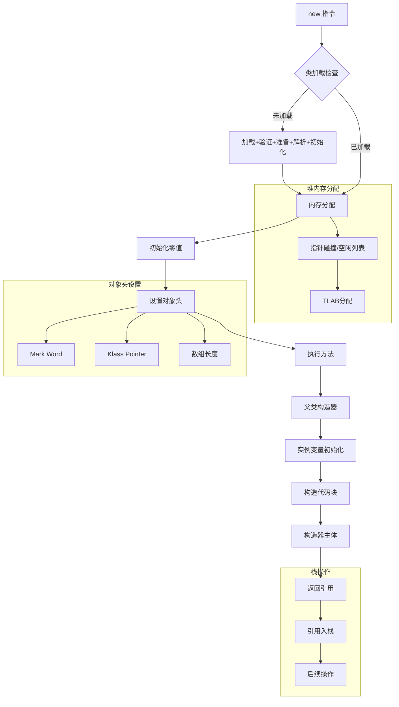
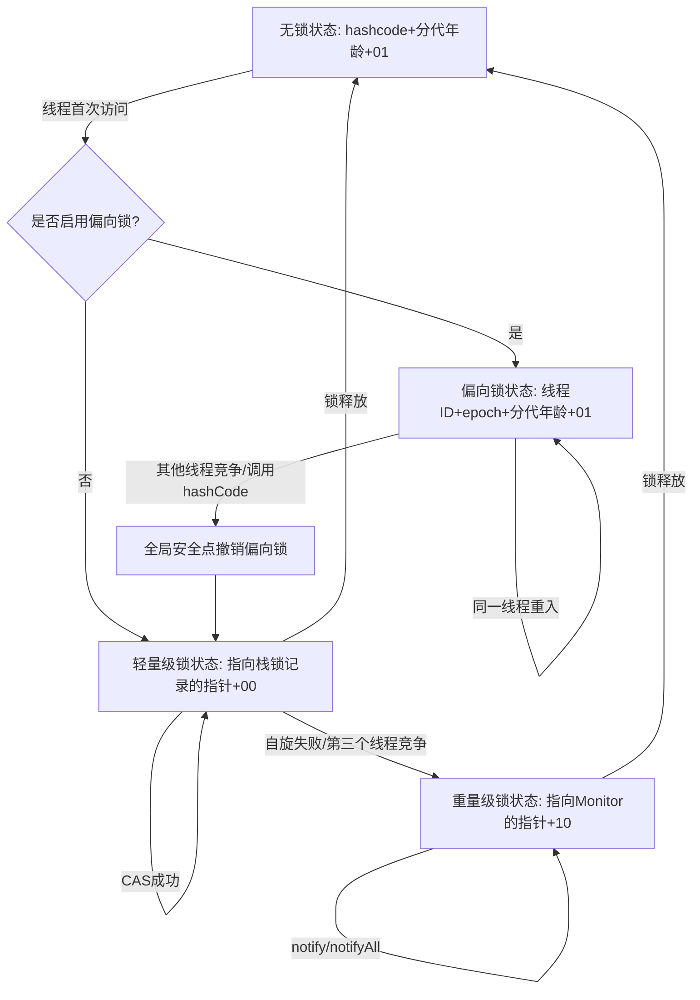

# 深入JVM：一个Java对象的诞生、内存布局、锁机制与内存对齐的奥秘

Java程序员每天都在与对象打交道，从简单的 `new Object()` 到复杂的业务实体，对象无处不在。然而，一个Java对象在JVM内部究竟是如何从无到有，又如何在内存中安家落户，并被多线程安全地访问的呢？这背后隐藏着一套复杂而精妙的机制。本文将带你跳出Java语言的表层，深入JVM的腹地，**细致剖析一个Java对象的整个生命周期**，从字节码指令到内存深处，从对象头到锁的演进，揭示这些看似简单的操作背后所蕴含的计算机科学与工程智慧。

### 1.Java对象的“怀孕”到“诞生”：创建过程的极致解构

当我们在Java代码中写下`Object obj = new Object();`这样一行代码时，JVM内部远比我们想象的要忙碌。一个对象的创建过程可以分解为以下几个关键步骤：

#### 1.1 类加载检查：溯源对象的基因蓝图

JVM遇到 `new` 指令时，首先会去**常量池**中查找该指令参数所代表的**符号引用**。这个符号引用指向的类是否已经被加载（load）、解析（resolve）和初始化（initialize）过？如果答案是否定的，那JVM必须立即执行相应的**类加载过程**。

- **加载（Loading）**：通过类的完全限定名获取定义此类的二进制字节流（通常是`.class`文件），然后将其中的静态存储结构转换为方法区的运行时数据结构，并在堆中生成一个代表该类的`java.lang.Class`对象。这个`Class`对象是所有对象创建的“基因蓝图”。
- **验证（Verification）**：确保Class文件的字节流中包含的信息符合JVM规范，没有安全问题。这是JVM保护自身的重要防线。
- **准备（Preparation）**：为类的**静态变量（static fields）分配内存并设置零值**。注意，这里仅仅是赋零值，不包含显式初始化的操作，那是初始化阶段的事情。例如，`static int value = 123;`在准备阶段`value`是0，而不是123。
- **解析（Resolution）**：将常量池中的**符号引用（Symbolic References）替换为直接引用（Direct References）**。直接引用可以是直接指向目标的指针、句柄或偏移量。
- **初始化（Initialization）**：执行类构造器`<clinit>()`方法。这个方法是编译器收集类中所有静态变量的赋值动作和静态代码块（`static {}`）中的语句合并产生的。这是类加载过程中真正开始执行Java代码的阶段。在这个阶段，静态变量才会被赋予程序员指定的值。

只有当这些步骤都顺利完成，JVM才真正掌握了如何“制造”这个对象的所有先决条件。

#### 1.2 内存分配：为新对象开辟“栖身之所”

当类加载检查通过后，JVM需要在**Java堆**中为新生对象分配内存。对象所需内存的大小在类加载完成后便可完全确定。内存分配策略主要有两种：

- **指针碰撞（Bump the Pointer）**：如果Java堆中内存是规整的，即已用内存和空闲内存各据一边，中间有个指针指示分界点。那么分配内存就简单了：仅仅是将指针向空闲空间方向挪动与对象大小相等的距离。这种方式效率高，适用于采用“标记-整理”（Mark-Compact）算法或“复制”（Copying）算法的垃圾收集器，如Serial、ParNew、G1等。
- **空闲列表（Free List）**：如果Java堆内存不规整，已用内存和空闲内存交错分布，JVM就需要维护一个列表，记录哪些内存块是可用的。分配内存时，从列表中找到一块足够大的空间划给新对象，并更新列表记录。这种方式效率相对较低，适用于采用“标记-清除”（Mark-Sweep）算法的垃圾收集器，如CMS。

**并发挑战与解决方案：** 在多线程环境下，为对象分配内存并非易事。多个线程可能同时申请内存，这可能导致指针偏移量出现错误或者对空闲列表的并发修改问题。JVM主要采取两种策略来保证线程安全：

1. **CAS（Compare And Swap）加锁**：对内存分配区域的指针或空闲列表进行CAS操作。当一个线程尝试分配内存时，它会先读取当前指针位置，然后尝试CAS写入新的位置。如果CAS失败（说明有其他线程在此期间分配了内存），则重试。这种方式虽然保证了原子性，但频繁重试可能导致性能损耗。
2. **本地线程分配缓冲（Thread Local Allocation Buffer, TLAB）**：这是HotSpot JVM默认且最常用的优化手段。每个线程在Java堆中预先分配一小块独立的内存区域，称为TLAB。线程在TLAB上分配内存时，无需同步，极大地提高了分配效率。只有当TLAB用完需要重新分配新的TLAB时，才需要进行同步锁定（通常是CAS操作）。如果TLAB分配失败，则尝试在共享的堆区分配，此时才可能使用CAS或其他同步机制。TLAB的大小通常由JVM自动调整，一般为几KB到几十KB。


#### 1.3 初始化零值：对象的“素颜”状态

内存分配完成后，JVM会将分配到的内存空间（不包括对象头，因为对象头有其自身的复杂结构）都初始化为**零值**。这意味着对象的**实例字段**在Java代码中即使没有显式赋值，也能保证其拥有一个默认值。例如，`int`类型字段初始化为0，`boolean`为`false`，引用类型为`null`。这个步骤是保证程序安全性的重要一环，避免了未初始化字段的随机值问题。

#### 1.4 设置对象头：对象的“身份证”与“户口本”

初始化零值之后，JVM会根据对象的实际情况，对对象进行一系列必要的设置。这些信息存放在对象最前面的**对象头（Object Header）**中。对象头可以看作是对象的“身份证”和“户口本”，它包含了对象运行时所需的所有元数据：

- **哈希码（HashCode）**：对象的散列码，用于`HashMap`、`HashSet`等数据结构。
- **GC分代年龄（Generational GC Age）**：记录对象在新生代中熬过了多少次Minor GC。
- **锁状态标志（Lock State）**：指示对象当前所处的锁状态（无锁、偏向锁、轻量级锁、重量级锁）。
- **偏向线程ID（Biased Lock Thread ID）**：如果对象处于偏向锁状态，记录持有该偏向锁的线程ID。
- **偏向时间戳（Epoch）**：用于偏向锁撤销的判断。
- **指向锁记录的指针/Monitor指针**：在轻量级锁或重量级锁状态下，指向相应的锁信息。
- **指向类型元数据（Klass Pointer）的指针**：指向该对象对应的`Class`对象在方法区中的地址，JVM通过这个指针来确定该对象是哪个类的实例，从而找到其方法、字段等元信息。

这些信息是JVM运行时数据的重要组成部分，后面我们还会详细探讨对象头的结构。

#### 1.5 执行 `<init>` 方法：赋予对象“生命”和“意义”

在上述所有底层操作完成后，从JVM的视角来看，一个对象的内存空间已经被分配并初始化，其元数据也已设置完毕。但从Java程序的视角来看，对象创建才刚刚开始——因为我们还没有执行构造函数！

`new`指令之后，会接着执行对象的**`<init>`方法**。这个`<init>`方法是Java编译器为每个类生成的特殊方法，它包含了：

- 程序员在构造函数中定义的逻辑代码。
- 字段的显式初始化代码。
- 调用父类构造器的代码（如果没有显式调用，编译器会插入默认的无参父类构造器调用）。

通过执行`<init>`方法，对象才真正根据程序员的意图进行初始化，赋予其业务含义，成为一个真正可用的Java对象。

### 2. 对象的内存布局：JVM中的“豪宅”结构

在HotSpot JVM中，一个对象在内存中的存储布局可以形象地划分为三大区域：**对象头（Object Header）**、**实例数据（Instance Data）和对齐填充（Padding）**。理解这些区域的构成，是理解Java内存管理和性能优化的基础。

```
+-----------------------------------+
|       对象头 (Object Header)      |
|-----------------------------------|
|     Mark Word (标记字) - 64 bits  |
|     Klass Pointer (类型指针) - 32 bits (Compressed Oops) |
|-----------------------------------|
|       实例数据 (Instance Data)    |
|-----------------------------------|
|     父类继承的字段                |
|     自身定义的字段                |
|       (可能按类型、宽度排序)      |
|-----------------------------------|
|       对齐填充 (Padding)          |
|-----------------------------------|
|     保证对象总大小是8字节的倍数   |
+-----------------------------------+
```

#### 2.1 对象头（Object Header）：对象的“灵魂”与“元数据”

对象头是JVM实现对象各种运行时数据（如锁状态、GC年龄等）的基础，也是理解Java并发编程中`synchronized`关键字魔力的关键。它由两部分组成：

1. **Mark Word（标记字）**：这是对象头中最复杂也是最重要的一部分。它用于存储对象自身的运行时数据，其内部结构会随着对象的**锁状态**而动态变化。 在64位JVM中，Mark Word通常占用64位（8字节）。其详细位域分配如下：

   - **无锁状态（Normal）**：
     - 高31位（或更高）：`HashCode`（哈希码，`Object.hashCode()`方法的返回值）。
     - 中间25位：未用（或者可能存储GC年龄等）。
     - 低4位：`GC分代年龄`（GC Age）。
     - 低2位：`01`（锁标志位，表示无锁）。
     - 低1位：`0`（是否偏向锁标志位，0表示不可偏向或未偏向）。
     - **示例**：`[unused(25)|hashcode(31)|age(4)|01(lock)]`
   - **偏向锁状态（Biased）**：
     - 高54位：`线程ID`（持有偏向锁的线程ID）。
     - 低2位：`Epoch`（偏向锁的时代编号，用于偏向锁撤销的判断）。
     - 低4位：`GC分代年龄`。
     - 低2位：`01`（锁标志位）。
     - 低1位：`1`（是否偏向锁标志位，1表示偏向锁）。
     - **示例**：`[ThreadID(54)|Epoch(2)|age(4)|1(biased)|01(lock)]`
   - **轻量级锁状态（Lightweight Locked）**：
     - 高62位：`指向栈中锁记录的指针`（指向线程栈帧中Lock Record的指针）。
     - 低2位：`00`（锁标志位）。
     - **示例**：`[ptr_to_lock_record(62)|00(lock)]`
   - **重量级锁状态（Heavyweight Locked）**：
     - 高62位：`指向Monitor对象的指针`（指向堆中Monitor对象的指针）。
     - 低2位：`10`（锁标志位）。
     - **示例**：`[ptr_to_monitor(62)|10(lock)]`
   - **GC标记状态（Marked for GC）**：
     - 高62位：`空`。
     - 低2位：`11`（锁标志位）。
     - **示例**：`[unused(62)|11(lock)]`

   ```mermaid
   graph LR
   A[Mark Word] --> B[锁状态]
   B --> C["无锁：hashcode+分代年龄+01"]
   B --> D["偏向锁：线程ID+时间戳+分代年龄+01"]
   B --> E["轻量锁：指向栈中锁记录的指针+00"]
   B --> F["重量锁：指向Monitor的指针+10"]
   B --> G["GC标记：空+11"]
   
   ```

   

2. **Klass Pointer（类型指针）**： 在64位JVM中，默认开启**指针压缩（UseCompressedOops）**。这意味着对象引用（包括Klass Pointer）会从64位压缩到32位，以节省内存空间。

   - 如果开启了指针压缩，Klass Pointer占用**32位（4字节）**。
   - 如果未开启指针压缩（或者在32位JVM上），Klass Pointer占用**64位（8字节）**。 这个指针指向该对象对应的**类元数据（Class Metadata）**在**方法区（或元空间Metaspace）**的地址。JVM通过这个指针，可以得知该对象属于哪个类，从而获取类的所有信息（方法、字段、父类等）。

因此，一个不包含任何字段的空对象（`new Object()`）在64位开启指针压缩的JVM中，其大小为：

- Mark Word：8字节
- Klass Pointer：4字节
- 对齐填充：4字节 (为了满足8字节对齐)
- **总计：16字节**

#### 2.2 实例数据（Instance Data）：对象的“内涵”

实例数据是对象真正存储的有效信息，即我们在Java代码中定义的各种类型的字段，包括：

- **父类继承的字段**：子类对象会包含其父类的所有非静态字段。
- **自身定义的字段**：对象本身的实例字段。

这些字段的存储顺序并非完全随意，而是受到JVM参数（如`-XX:FieldsAllocationStyle`）和字段在代码中定义顺序的影响。HotSpot JVM通常会遵循以下原则进行字段的布局，以提高存取效率：

1. **相同宽度的字段会尽可能分配到一起**：例如，所有`int`字段放在一起，所有`long`字段放在一起。
2. **父类字段优先于子类字段**：继承的字段会排在子类自身字段的前面。
3. **大宽度字段优先于小宽度字段**：例如，`long`/`double`等8字节字段会优先于`int`/`float`等4字节字段，然后是`short`/`char`等2字节字段，最后是`byte`/`boolean`等1字节字段。这种方式有助于在内存中紧凑排列，提高缓存命中率。

例如，一个`MyClass`类包含一个`long`字段，一个`int`字段和一个`boolean`字段：

```java
class MyClass {
    long l;
    int i;
    boolean b;
}
```

在实例数据区，它们的典型排列可能是：`long l` (8字节) -> `int i` (4字节) -> `boolean b` (1字节)

#### 2.3 对齐填充（Padding）：为了“规整”而存在的补丁

对齐填充是对象内存布局中的一个“占位符”，它并不是对象本身的有效数据。它的存在是为了保证**对象总长度是8字节的整数倍**。

- **为什么要对齐？**

  - **CPU缓存行（Cache Line）**：现代CPU从内存中读取数据通常是以**缓存行**为单位的，一个缓存行通常是64字节。如果对象不对齐，一个对象可能横跨多个缓存行，导致CPU需要进行多次内存访问才能完整读取对象，降低效率。
  - **内存访问效率**：大多数硬件平台对基本数据类型的访问是有内存对齐要求的。例如，一个4字节的`int`通常要求其地址是4的倍数。JVM将整个对象对齐到8字节，有助于保证内部字段的对齐，从而提高CPU访问字段的效率。
  - **原子性操作**：一些多线程原子操作（如CAS）要求操作的内存地址是对齐的。

- **如何实现？** JVM在计算完对象头和实例数据总和后，如果这个总和不是8的倍数，就会在末尾补充0到7个字节的空位，直到整个对象的大小是8的倍数。

  **示例：** 假设一个对象：

  - 对象头：8字节 (Mark Word) + 4字节 (Klass Pointer) = 12字节 (已开启指针压缩)
  - 实例数据：`long` (8字节) + `int` (4字节) + `boolean` (1字节) = 13字节
  - 总计：12 + 13 = 25字节

  25字节不是8的倍数。最接近且大于25的8的倍数是32。 因此，需要填充 `32 - 25 = 7` 字节的对齐填充，最终这个对象在内存中将占用32字节。



### 3. Java对象中的锁与锁升级：`synchronized`的奥秘

在Java多线程编程中，为了保证共享数据的**原子性、可见性和有序性**，我们常常使用`synchronized`关键字。`synchronized`的本质是基于JVM的**Monitor（监视器）机制，而这个Monitor信息就存储在对象头中的Mark Word**里。HotSpot JVM为了优化并发性能，引入了**锁升级（Lock Escalation）**机制，即锁会根据竞争的激烈程度，从开销最小的无锁状态逐步升级为开销最大的重量级锁。

#### 3.1 无锁状态：风平浪静


- **特点**：当对象刚被创建，且没有任何线程试图获取其锁时，对象头中的Mark Word处于**无锁状态**。此时，Mark Word中主要存储对象的**哈希码**和**分代年龄**，以及锁标志位`01`和偏向锁标志位`0`。
- **开销**：几乎没有额外的开销，除了对象头本身占用的空间。


#### 3.2 偏向锁（Biased Locking）：“专宠”模式


- **思想**：如果一个对象几乎总是被同一个线程访问和加锁，那么就没有必要进行复杂的同步操作。偏向锁的目的是在**无竞争**的情况下，消除同步带来的开销。
- **原理**：当一个线程第一次访问某个对象的`synchronized`代码块时，JVM会尝试将该对象的Mark Word设置为**偏向锁状态**，并将其**线程ID**记录在Mark Word中。同时，将偏向锁标志位设置为`1`。
- **获取锁**：此后，如果该线程再次访问这个对象，JVM只需检查Mark Word中的线程ID是否与当前线程ID一致。如果一致，就表示该线程已经获得了偏向锁，无需进行任何同步操作，直接进入同步块。这是一种非常高效的“**免锁**”机制。
- **撤销（Revocation）与升级**：
  - **触发条件**：当有**另一个线程**尝试获取该对象的锁，或者当调用`hashCode()`方法时（因为哈希码会占用Mark Word的一部分，与偏向锁信息冲突），偏向锁就会被**撤销**。
  - **撤销过程**：偏向锁的撤销并非简单地清除Mark Word。JVM会暂停拥有偏向锁的线程（Safepoint），然后检查持有偏向锁的线程是否仍在执行同步代码块。
    - 如果该线程已经退出了同步块，则偏向锁会被撤销，对象头恢复到无锁状态或直接升级为轻量级锁（取决于是否有竞争线程）。
    - 如果该线程仍在执行同步块，JVM会**升级**偏向锁为**轻量级锁**，并将持有偏向锁的线程转为持有轻量级锁。
  - **开销**：偏向锁的撤销是一个相对重量级的操作，因为需要暂停（Safepoint）相关线程。频繁的偏向锁撤销反而会降低性能。因此，JVM提供了参数来禁用偏向锁（`-XX:-UseBiasedLocking`），或者延迟偏向锁的启动时间。


#### 3.3 轻量级锁（Lightweight Locking）：自旋的艺术


- **思想**：当多个线程在短时间内交替竞争同一个锁，但竞争程度不至于非常激烈（即线程不会长时间阻塞）时，轻量级锁能够提供比重量级锁更优的性能。它避免了操作系统级别的线程上下文切换开销。
- **原理**：
  1. 当一个线程尝试获取锁时，如果发现对象处于**无锁状态**或**偏向锁被撤销后**（有其他线程竞争），JVM会尝试将其升级为轻量级锁。
  2. 线程会在自己的栈帧中创建一个**锁记录（Lock Record）**空间。
  3. 然后，线程会尝试使用**CAS（Compare And Swap）操作，将对象的Mark Word复制到锁记录中，并将对象的Mark Word更新为指向栈中锁记录的指针**，同时设置锁标志位为`00`。
  4. 如果CAS操作成功，表示该线程成功获取了轻量级锁。
  5. 如果CAS操作失败（说明有其他线程也尝试获取锁），则说明存在竞争。当前线程不会立即阻塞，而是会尝试进行**自旋（Spin）**操作。它会在一定次数内反复尝试CAS获取锁，而不是立即放弃CPU。
- **自旋与适应性自旋**：
  - **自旋**：循环CAS操作，不断尝试获取锁。如果自旋成功，避免了线程上下文切换的开销；如果自旋失败，则最终会升级为重量级锁。
  - **适应性自旋**：HotSpot JVM的自旋不再是固定的次数，而是动态调整。如果上次某个线程自旋成功了，那么JVM认为这次自旋成功的可能性也很大，会允许它自旋更多次；反之，如果上次自旋失败，则可能会减少自旋次数或直接膨胀为重量级锁。
- **升级条件**：如果CAS自旋达到一定次数仍然无法获取锁，或者在持有轻量级锁的线程执行过程中，有其他线程尝试获取该锁并自旋失败，那么轻量级锁就会**膨胀（Inflate）为重量级锁**。


#### 3.4 重量级锁（Heavyweight Locking）：最终防线


- **思想**：重量级锁是Java中`synchronized`关键字提供的最原始也是最安全的锁实现，它能够保证线程的公平性和线程安全性。当竞争激烈，轻量级锁无法满足需求时，就会升级到重量级锁。
- **原理**：
  1. 当轻量级锁膨胀时，JVM会在堆中创建一个**Monitor（监视器）对象**。这个Monitor对象是操作系统的**互斥量（Mutex）**的封装。
  2. 对象的Mark Word会被更新为指向这个Monitor对象的指针，并设置锁标志位为`10`。
  3. 未能获取锁的线程会被**阻塞（Blocked）**，并进入Monitor对象的**等待队列**（Wait Set）或**竞争队列**（Entry Set）。这些线程会被操作系统调度器挂起，不占用CPU资源。
  4. 当持有锁的线程释放锁时，会唤醒等待队列中的一个或多个线程，使其重新尝试获取锁。
- **开销**：重量级锁的最大开销在于**线程上下文切换**。当线程被阻塞和唤醒时，需要OS从用户态切换到内核态，这个过程消耗的CPU时间远大于偏向锁和轻量级锁的开销。
- **适用场景**：适用于竞争非常激烈，且同步代码块执行时间较长的场景。



通过这种逐级升级的机制，JVM能够在不同并发场景下，以最小的开销实现线程同步，兼顾了性能和安全性。

### 4. 对象内存对齐：内存的“整齐划一”

前文提到，HotSpot JVM要求对象在内存中的起始地址必须是**8字节的整数倍**，并且对象总大小也必须是**8字节的整数倍**。这就是对象的**内存对齐（Object Alignment）**。

#### 4.1 对齐的目的：为何如此执着于“规整”？

内存对齐并非JVM独有，它是计算机体系结构中的一个普遍概念，其目的主要有：

- **CPU访问效率提升**：CPU在读取内存数据时，通常是按字（Word）或缓存行（Cache Line）为单位进行操作。
  - 一个字（Word）在32位系统是4字节，在64位系统是8字节。
  - 一个缓存行通常是64字节。 如果一个数据没有对齐到其大小的倍数边界上，那么CPU可能需要进行多次内存访问（跨越多个总线事务或缓存行）才能完整读取这个数据，这会大大降低读取效率。通过8字节对齐，可以确保对象及其内部的大部分字段都能高效地被CPU读取，减少跨缓存行访问的概率。
- **原子性保证**：某些多线程原子操作（如CAS）在硬件层面要求操作的内存地址是对齐的，否则可能无法保证操作的原子性。对象对齐有助于为这些操作提供必要的基础。
- **兼容性与跨平台**：不同的硬件平台对内存访问的对齐要求可能不同。JVM通过统一的对齐策略，可以简化底层内存管理，提高代码的跨平台兼容性。


#### 4.2 对齐的实现：填充字节的智慧


JVM在分配对象内存时，会确保：

1. 对象的起始地址是8字节的整数倍。
2. 对象的总大小也是8字节的整数倍。

当对象头和实例数据加起来的总和不是8字节的倍数时，JVM就会在对象的末尾添加**对齐填充（Padding）**字节，这些字节没有任何实际意义，仅仅是为了将对象的总大小“补齐”到8字节的最近倍数。

**示例：** 假设一个对象有以下组成部分：

- **对象头**：
  - Mark Word：8字节
  - Klass Pointer：4字节 (假设开启指针压缩)
  - 对象头总计：12字节
- **实例数据**：
  - `int a;`：4字节
  - `byte b;`：1字节
  - 实例数据总计：4 + 1 = 5字节
- **对象头 + 实例数据总和**：12 + 5 = 17字节

现在，17字节不是8的倍数。我们需要找到比17大且是8的倍数的最小整数，那就是24。 因此，需要添加的对齐填充字节数为：`24 - 17 = 7`字节。 最终，这个对象在内存中将占用`8 + 4 + 4 + 1 + 7 = 24`字节。


#### 4.3 指针压缩（Compressed Oops）对对齐的影响

在64位JVM中，为了节约内存，HotSpot默认开启了**指针压缩（-XX:+UseCompressedOops）**。

- 当指针压缩开启时，对象引用（包括Klass Pointer、普通对象字段引用、数组元素引用）会从64位（8字节）压缩成32位（4字节）。这能显著减少内存占用。
- 尽管指针被压缩到了4字节，但HotSpot JVM仍然通常会保持对象**8字节对齐**。这是通过对基础地址进行调整来实现的。这意味着即使Klass Pointer是4字节，对象整体仍然会遵循8字节对齐规则，可能会有额外的填充。